# Introduction to GitHub.
This article gives an introductory guide to Git for beginners. It will teach you the fundamentals of Git and how to effectively publish your work to a GitHub repository.

## Prerequisites
Before going with this content, I recommend that you have a basic grasp of the following and that your computer is set up for git use.

- You should have Visual Studio Code installed on your machine.
- You should Have a fundamental grasp of several terminal commands.
- You must have a GitHub account.

## The table of content
* Introduction
* What is GitHub
* What is Git
* Why GitHub
* Git vs. GitHub
* Clone (Show how to do cloning)
* Commit (Show how to do a commit)
* Pull request (Show how to do a pull request)
* GitHub Desktop vs. Github CLI
* Conclusion

## What is GitHub?
GitHub is a cloud-based website where code or projects may be saved and monitored. Developers, technical writers, and cloud engineers use GitHub to save their projects so that team members from all around the world may access and contribute to them.

## What is Git?
Git is a version control system (VSC) that lets you track changes to your repository (project stored on GitHub). It is installed locally on your computer and facilitates project team communication by enabling them to upload and download modifications from one another from a centralized site (GitHub repository).

## Why GitHub?
- It is straightforward to use, with users being able to instantly submit and pull code.
- It is an open source project that lets you to safely preserve your code in a decentralized system while also allowing you to collaborate with others all over the world to work on your project.
- It helps firms or teams manage their code base effectively.
- It is beneficial to exhibit all of one's work so that IT companies or recruitment agencies may get a sense of the various projects one has worked on.

## Git vs GitHub
GitHub is a source code hosting platform where projects (repositories) may be reviewed with Git, a version control system that allows you to make changes to source code.
            

 

## How to Clone a Repository from GitHub
What does it mean to clone a repository?  To clone a repository means to duplicate and download everything in the repository to your local machine. First, you need to **create** [(here)](https://docs.github.com/en/repositories/creating-and-managing-repositories/creating-a-new-repository) a repository before cloning it to your local machine (computer). 

### **Procedures**
1. To clone a repository, navigate to the repository's website and click the **code** button.

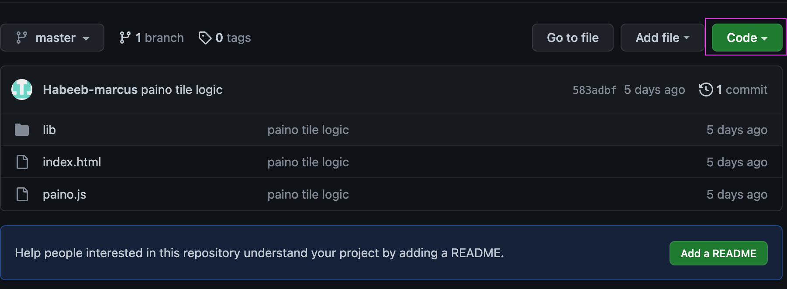

2. Copy the link that appears after clicking the button

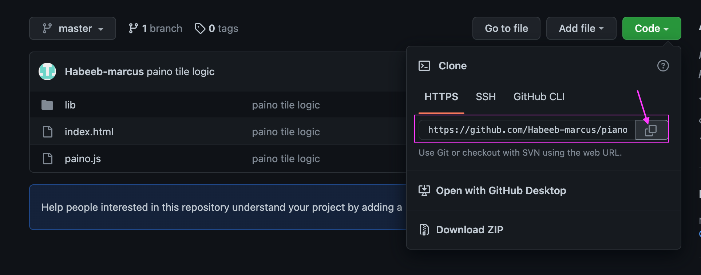

3. Create a folder for the repository you want to clone and open on VScode editor:

 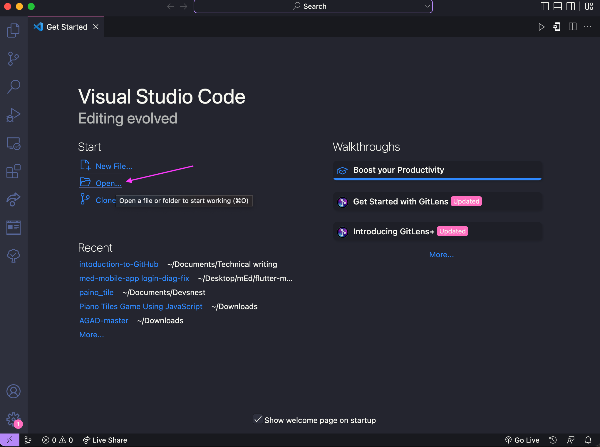

  
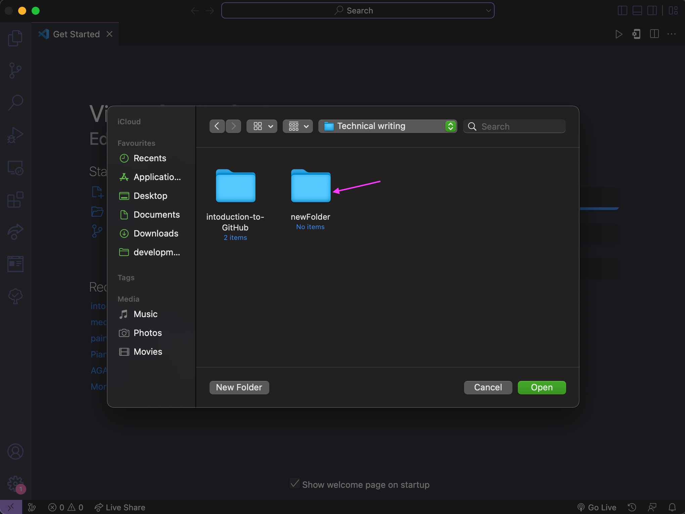

4. Enter the following command into your VScode terminal:
        
        git clone <link copied from repository>
        example:
        git clone https://github.com/Habeeb-marcus/piano_tile.git

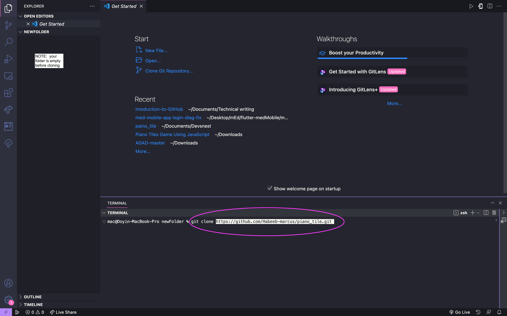

5. repository clone successfully 

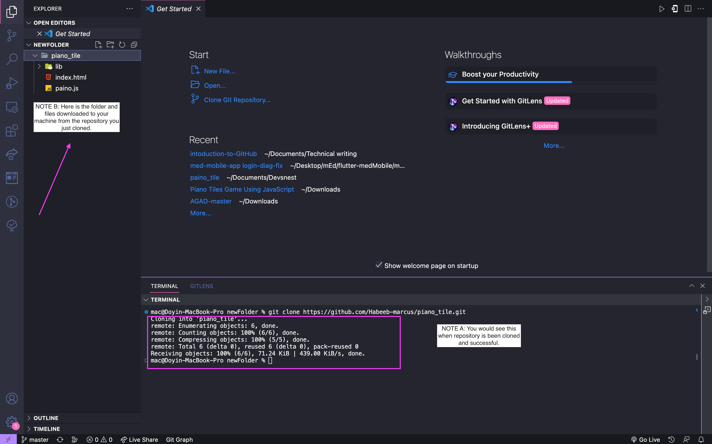

6. Finally, you can connect the remote repository to your local machine by entering this command:

        git remote add origin <link copied from repository>
        example:
        git remote add origin https://github.com/Habeeb-marcus/piano_tile.git

## How to make a Commit.
A commit is a way of attaching a message to the changes you make to the source code, however before we can commit, we must first complete the following:

After cloning your repository, keep in mind that the branch you cloned is the main/master branch, and you should not make modifications to it directly. As a result, you must build your own unique branch to work on.

**What exactly is a branch**? A branch is a fresh copy of the cloned repository's master branch. You may name your branch whatever you like and make modifications to it before merging it back into the main branch to save your changes.

<!-- image of branch -->

1. To make a new branch, type the following into your terminal:

        git checkout -b <your-branch-name>

<!-- image of branch being created -->
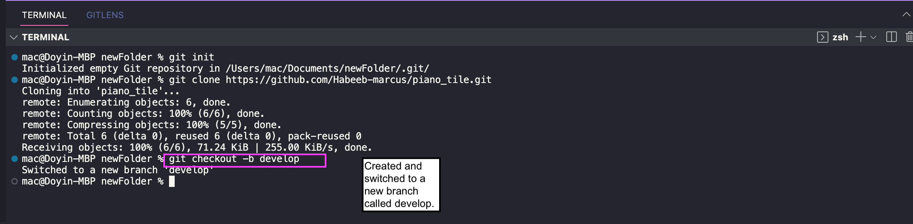
##  Procedures
Before we make a commit, we must first:

1. Make any necessary modifications to the source code, then run 'git add .' The dot indicates that all modifications to the source code will be added to the secret git repo:

        git add .

2. on the terminal, enter the following command 
        
        git commit -m 'write your commit message here'

3. push your changes made, by entering 

        git push origin <your-branch-name>

## How to make pull Request

The process of merging new code modifications into the main project repository is known as pull requests (PR).
You must have completed the whole process of making changes to the source code and committing your modifications before submitting a pull request.

1. In the terminal, hold down cmd/ctrl + click on the link that says make a Pull request.

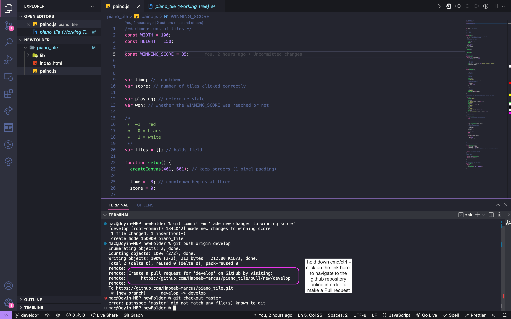

2. After clicking the link above to open the github repository in your browser, then click the 'Compare & Pull request' option.

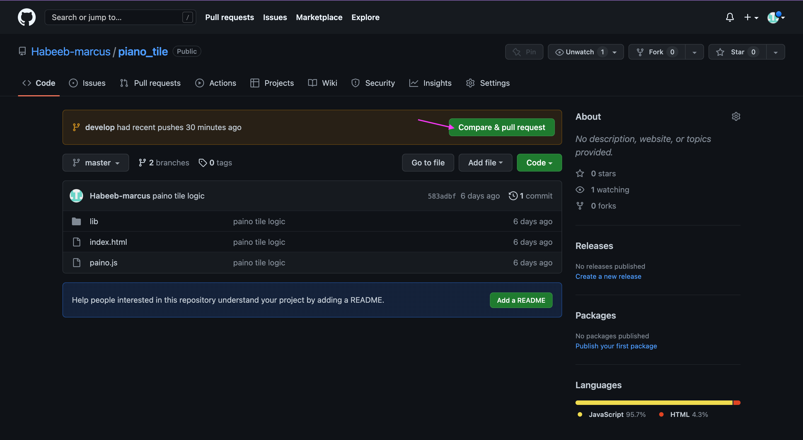

3. You'd be sent to this screen, where you'd click the Create Pull Request button.
   
   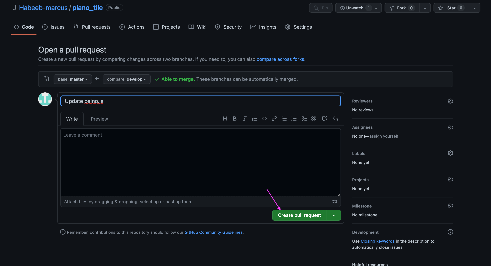

4. Congratulations on making a pull request, however your modifications will be merged to the main branch by the repository's owner, once it has been evaluated with this button
   
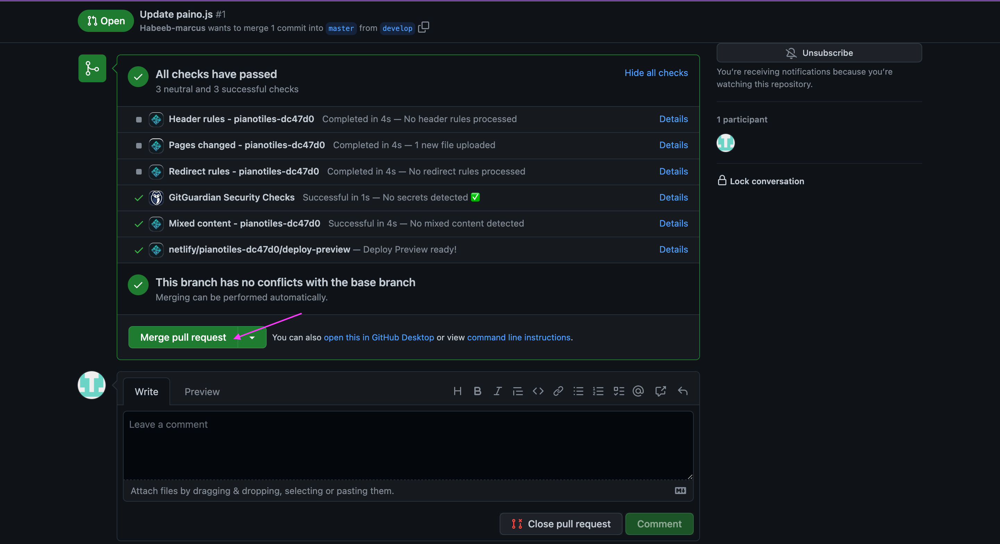
    

## GitHub Desktop vs. Github CLI

According to a post by WhiteBeamz on the Reddit website.
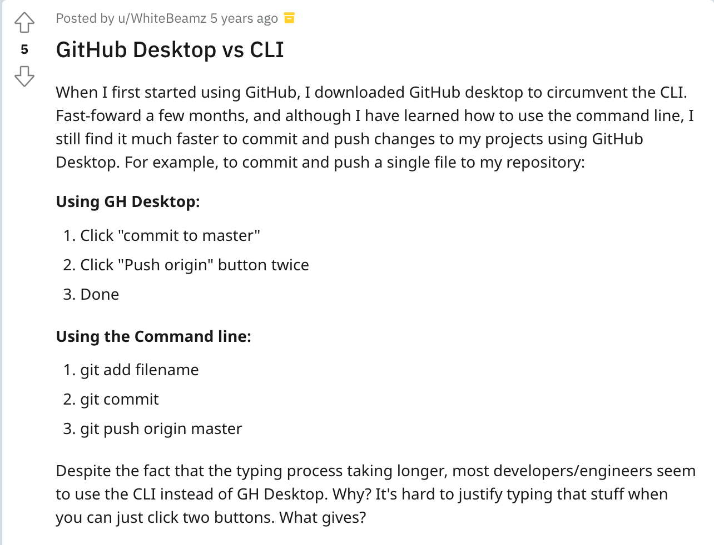

## Conclusion
There are many more commands in Git than those mentioned here. It is a complex framework with various options to track code changes over time and work on the application's source code.
If you want to learn more about these commands and other Git features, this is a great place to start: [GitHub Docs](https://docs.github.com/en/repositories)

