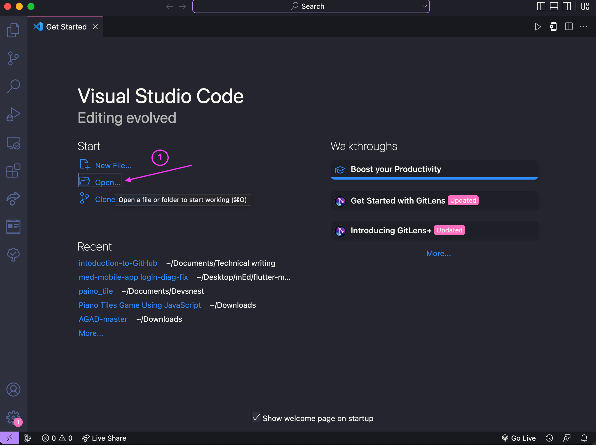

# Introduction to GitHub.

## Prerequisites
Before going with this content, I recommend that you have a basic grasp of the following and that your computer is set up for git use.

- Have Visual Studio Code installed on your machine, because this tutorial will only be using VScode for explanation.
- Have a basic understanding of several terminal commands.
- You should have a GitHub account.

## The table of content
* Introduction
* What is GitHub
* What is Git
* Why GitHub
* Git vs. GitHub
* Clone (Show how to do cloning)
* Commit (Show how to do a commit)
* Pull request (Show how to do a pull request)
* GitHub Desktop vs. Github CLI
* Conclusion

## What is GitHub?
GitHub is a cloud-based platform where code or projects can be stored, created and modified with a tool called Git. Developers, technical writers, and cloud engineers use GitHub to save their projects so that team members from all around the world may access and contribute to them.

## What is Git?
Git is a version control system (VSC) that lets you track changes to your repository (project stored on GitHub). It is installed locally on your computer and facilitates project team communication by enabling them to upload and download modifications from one another from a centralized site (GitHub repository).

## Why GitHub?
- It is straightforward to use, with users being able to instantly submit and pull code.
- It is an open source project that lets you to safely preserve your code in a decentralized system while also allowing you to collaborate with others all over the world to work on your project.
- It helps firms or teams manage their code base effectively.
- It is beneficial to exhibit all of one's work so that IT companies or recruitment agencies may get a sense of the various projects one has worked on.

## Git vs GitHub
            

 Rishabh, Jain. "Article on GIT and GITHUB" , 15 Jun. 2021
 | GIT | GITHUB |
| ------ | ----------- |
| Distrubuted version control system to track changes in source code   | Web based cloud service to host GitHub repositories to be shared across teams. |
| Command line interface requires another platform to share with the world. | Graphical interface, a development platform for millions of people. |
| Creates a local repository and stores changes on your local machine    |  Code is stored on a central server, accessible to everyone. |
| Can work without GitHub, as there are alternatives platforms to share Git repositories    | The most popular Git server. There are alternatives such as GitLab or BitBucket. |

## How to Clone a Repository from GitHub
What does it mean to clone a repository?  To clone a repository means to download everything in the repository to your local machine. First, you need to **create** [(here)](https://docs.github.com/en/repositories/creating-and-managing-repositories/creating-a-new-repository) a repository before cloning to your local machine (computer). 

### **Procedures**
1. To clone a repository, navigate to any repository's website [(here)](https://github.com/Habeeb-marcus/piano_tile) and click the **code** button.

2. Copy the link that appears after clicking the button

3. Create a folder for the repository you want to clone and open on the VScode editor:

 

  

4. Enter the following command into your VScode terminal:

###  Syntax

     git clone <link copied from repository>
        

### Command
     git clone https://github.com/Habeeb-marcus/piano_tile.git

5. repository clone successfully 

6. Finally, you can connect the remote repository to your local machine by entering this command:

###  Syntax

      git remote add origin <link copied from repository>
        

### Command
     git remote add origin https://github.com/Habeeb-marcus/piano_tile.git

## How to make a Commit.
A commit is a way of attaching a message to the changes you make to the source code. However, before we can commit, we must first complete the following:

After cloning your repository, keep in mind that the branch you cloned is the main/master branch, and you should not make modifications to it directly. As a result, you must build your own unique branch to work on.

**What exactly is a branch**? A branch is a copy of the cloned repository's (master branch). You may name your branch whatever you like and make modifications to it before merging it back into the main branch to save your changes.

<!-- image of branch -->
Amina, Mollaysa. "From Git-Virgin to Git-Pro" 29 Jan. 2019.

* To make a new branch, type the following into your terminal:

###    Syntax

     git checkout -b <your-branch-name>

###    Command

     git checkout -b develop
<!-- image of branch being created -->

##  Procedures
Before we make a commit, we must first:

1. Make any necessary modifications to the source code, then run `git add .` The dot indicates that all modifications to the source code will be added to the secret git repo:
   
   ### Command

        git add .

2. On the terminal, enter the following command 
   ### Syntax
        
        git commit -m 'write your commit message here'
   ### Command
        
        git commit -m 'changed the value of wining score'

3. Push your changes made, by entering 

   ### Syntax
        
        git push origin <your-branch-name>
   ### Command
        
       git push origin develop

        

## How to make pull Request

The process of merging new code modifications into the main project repository is known as pull requests (**PR**).
You must have completed the whole process of making changes to the source code and committing your modifications before submitting a pull request.

1. In the terminal, hold down `cmd/ctrl` + click on the link that says make a pull request.

2. After clicking the link above to open the github repository in your browser, then click the `Compare & pull request` option.

3. You'd be sent to this screen, where you'd click the `Create pull request` button.
   
   

4. Congratulations on making a pull request, however your modifications will be merged to the main branch by the repository's owner with the `Merge pull request` button, once it has been evaluated.
   

    

## GitHub Desktop vs. Github CLI
According to an image on SaaSHub website

According to a post by WhiteBeamz on the Reddit website.

| GitHub Desktop |  GitHub CLi |
| --------------- | ------------------ |
| Click "commit to master" | git add filename|
| Click "Push origin" button twice | git commit|
| Done | git push origin master|

## Conclusion
GitHub can really help you learn more about coding and hone your skills, which allows you to check other people's work and learn from them. It also helps developers contribute to open-source projects. If you want to learn more about GitHub, this is a great place to start: [GitHub Docs](https://docs.github.com/en/repositories)

